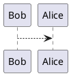

# eseo-s9-aquabot

## **1 Setup environment**

We need to install some tools to be able to run the simulation. Follow each step if you have a fresh Ubuntu 22.04 installation. If you already have some of the tools installed, you can skip the corresponding step. This was tested on a fresh Ubuntu 22.04 installation.

We will clone some repositories from github but you must have access to them. To make things easier, we will use github [client tool](https://cli.github.com/) to clone these repositories. You can install it with this command:

```bash
sudo apt install gh
```

Then you need to login to your github account with this command:

```bash
gh auth login
```

Then just follow the instructions to log in.
Once you are logged in, you will be able to use the `gh` command to clone repositories and you don't need to "login" again.

Let's move in the install directory:

```bash
cd install
```

We are now ready to install the tools using the scripts provided in this repository.

### 1.1 Setup ROS humble

First we need to install ROS humble, which is the required version for vrx. This script will install ROS humble based on [official documentation](https://docs.ros.org/en/humble/Installation.html).

```bash
./install_ros_humble.sh
```

### 1.2 Setup GAZEBO garden

Then we install GAZEBO garden, which is the required version for vrx. This script will install GAZEBO garden based on [official documentation](https://gazebosim.org/docs/garden/install_ubuntu).

```bash
./install_gazebo_garden.sh
```

### 1.3 Setup VRX

[Virtual RobotX](https://github.com/osrf/vrx) (VRX) is a high fidelity, Gazebo-based simulation environment for testing maritime robots. This script will install VRX based on [official documentation](https://github.com/osrf/vrx/wiki/getting_started_tutorial)

```bash
./install_vrx.sh
```

### 1.4 Setup our world

For this projet, we use gazebo worlds created by Serehna for their competition named, the worlds are defined in this [repository](https://github.com/sirehna/Aquabot).

Clone this repository in`~/vrx_ws/src`

```bash
cd ~/vrx_ws/src
gh repo clone sirehna/Aquabot
mv Aquabot aquabot
```

### 1.5 Add some examples (Optional)

This is not **mandatory** but you can add some examples provided by Serehna to play with the simulation. Examples are located in this [repository](https://github.com/sirehna/Aquabot-Competitor).

Clone this repository in`~/vrx_ws/src`

```bash
cd ~/vrx_ws/src
gh repo clone sirehna/Aquabot-Competitor
mv Aquabot-Competitor aquabot_competitor
```

Everyhting is now installed, we can start a simulation.

## **2 Run a simulation**

To start a simulation, we need to build the workspace and then launch the simulation.

### 2.1 Build the workspace

This step must be done each time you want to launch a simulation after updating the code.

```bash
cd ~/vrx_ws
colcon build --merge-install
. install/setup.bash
```

### 2.2 Launch the simulation

The following command will launch the simulation with a simple world.

```bash
ros2 launch aquabot_gz competition.launch.py world:=aquabot_regatta
```

### 3 Example inline plantuml


